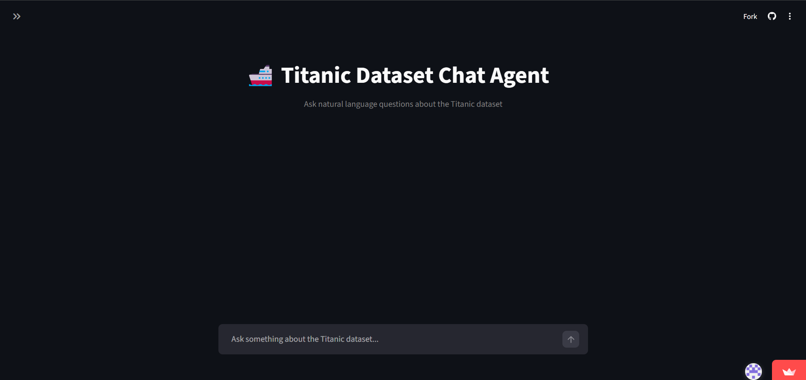
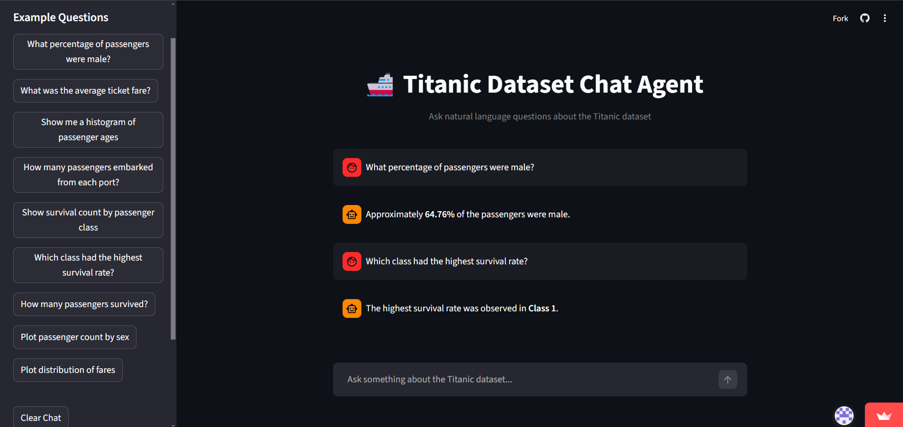
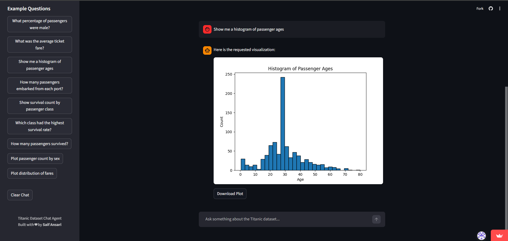

# 🚢 Titanic Dataset Chat Agent

An AI-powered data analysis chatbot built using **FastAPI, LangChain, Groq LLM, and Streamlit**.  
It allows users to ask natural language questions about the Titanic dataset and receive:

- 📊 Data insights
- 📈 Visualizations
- 💬 Conversational responses

---

## 🔗 Live Demo

👉 https://titanic-agent.streamlit.app/

---

## 🛠 Tech Stack

- **Frontend:** Streamlit
- **Backend:** FastAPI
- **LLM:** Groq (openai/gpt-oss-120b)
- **Framework:** LangChain (Tool Calling Agent)
- **Data Handling:** Pandas
- **Visualization:** Matplotlib
- **Deployment:** Render (Backend) + Streamlit Cloud (Frontend)

---

## ✨ Features

- Natural language data queries
- Automatic plot generation
- Downloadable charts
- Word-To-Word typing animation
- Clean interactive UI

---

## 📸 Screenshots

### 🏠 Landing Page



---

### 💬 Text Response Example



---

### 📊 Visualization Example



---

## 🧠 Example Questions

- What percentage of passengers were male?
- Show survival count by passenger class
- Plot distribution of passenger ages
- Which class had the highest survival rate?
- What was the average ticket fare?

---

## 🚀 How It Works

1. User submits a question via Streamlit UI.
2. Request is sent to FastAPI backend.
3. LangChain agent decides:
   - Use `analyze_data` tool for calculations
   - Use `visualize_data` tool for plots
4. Matplotlib generates image (base64).
5. Response returned as JSON.
6. Streamlit renders answer + plot.

---

## ⚙️ Local Setup

### 1️⃣ Clone Repository

```bash
git clone https://github.com/msaif2729/Titanic-Dataset-Chat-Agent.git
cd Titanic-Dataset-Chat-Agent
pip install -r requirements.txt
```

### 2️⃣ Backend Setup
```bash
uvicorn backend.app.main:app --reload
```

### 3️⃣ Frontend Setup
```bash
cd frontend
streamlit run app.py
```

### 👨‍💻 Author

Saif Ansari


